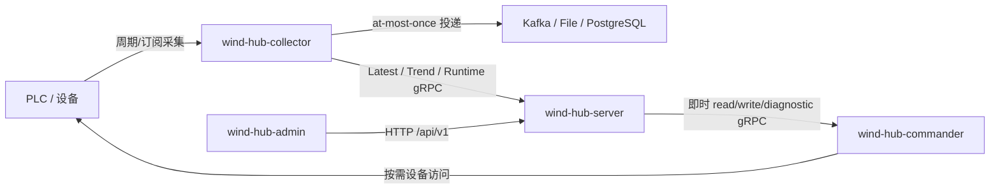

# wind-hub

wind-hub 是面向风电场设备的数据采集与控制基础软件。系统由独立的
Collector、Commander、Server、CLI 和 Web Admin 组成，共享
`wind_hub_core` 中的配置、协议、模型与 RPC 契约。

## 组件

| 组件 | 职责 |
|---|---|
| `wind-hub-collector` | 周期/订阅采集、设备连接管理、Task Instance、Sink 投递、采集读模型 |
| `wind-hub-commander` | 即时 read/write、协议诊断、控制回读 |
| `wind-hub-server` | Admin API、配置事务、Task placement、Worker 协调、质量与健康聚合 |
| `wind-hub-ctl` | Collector 运行态只读诊断 CLI |
| `wind-hub-admin` | Vue 3 + Element Plus 管理前端 |
| `wind_hub_core` | 配置 schema、统一模型、ADS/Modbus/IEC104 驱动、共享 gRPC 契约 |

## 数据与控制边界



Collector 的 Data/Trend 数据来自真实采集链；页面刷新不会通过 Commander
额外轮询设备。Commander 仅承担即时设备操作与诊断。

## 支持能力

### 协议

| 协议 | 当前能力 |
|---|---|
| ADS | TwinCAT 2/3；Sum/sequential 读取；写入；可选 Device Notification |
| Modbus TCP | Holding/Input/Coil/Discrete；批量读取；写入 |
| IEC 60870-5-104 | 总召、缓存读取、spontaneous、命令写入；可选从站代理支持主站总召与控制命令桥接 |

ADS 默认 TwinCAT 2，默认 AMS 端口 801；TwinCAT 3 默认端口 851。
显式 `target_port` / `ams_port` 优先于版本推导值。

### Sink

| 类型 | 实现 |
|---|---|
| Kafka | `aiokafka` |
| File | CSV / JSONL 本地文件；支持滚动与可选 gzip 压缩 |
| Database | PostgreSQL / `asyncpg` |

当前 Sink 交付语义为 **at-most-once**。Sink 队列背压或外部写失败导致的
点值丢失会计入 `points_dropped`；当前不提供持久化 spool/WAL/DLQ。

## 配置

业务配置使用 YAML，详见 [docs/config.md](docs/config.md)。样例位于
`configs/`。

运行参数原则：

- 设备、Task、Sink、协议参数：YAML；
- Server/Collector/Commander 监听地址等进程宿主参数：CLI；
- 当前产品代码仅使用 `WIND_HUB_COLLECTOR_ID` 作为 Collector ID 的可选环境变量；
- 测试外部服务变量见 `tests/test.env.example`。

## 安装

要求 Python 3.11+。

```bash
poetry install --all-extras
```

只安装所需可选协议/输出时，可按 Poetry extras 选择 `ads`、`modbus`、
`kafka`、`db`。

前端：

```bash
npm --prefix src/wind-hub-admin ci
```

## 最小本机启动

以下示例使用 `configs/template`，实际现场应换成对应配置目录。

终端 1：

```bash
poetry run wind-hub-collector \
  --config configs/template \
  --collector-id collector-1 \
  --grpc-host 127.0.0.1 \
  --grpc-port 50051
```

终端 2：

```bash
poetry run wind-hub-commander \
  --config configs/template \
  --grpc-host 127.0.0.1 \
  --grpc-port 50052
```

终端 3：

```bash
poetry run wind-hub-server \
  --config configs/template \
  --host 127.0.0.1 \
  --port 8080 \
  --collector collector-1=127.0.0.1:50051 \
  --commander 127.0.0.1:50052
```

Collector 诊断：

```bash
poetry run wind-hub-ctl --target 127.0.0.1:50051 status
```

各入口的完整参数以 `--help` 为准。

## 开发与验证

本地 Coding Agent 环境由 `.agent/local.json` 与 `scripts/dev.py` 管理：

```bash
cp .agent/local.example.json .agent/local.json
python3 scripts/dev.py env --frontend
```

质量门禁：

```bash
# 日常快速验证：按变更范围选择 static/unit/component/contract/frontend
python3 scripts/dev.py python scripts/ci_gate.py fast --part backend-static

# 风险增量验证：按 ci_scope.py 输出选择 integration/system target
python3 scripts/dev.py python scripts/ci_scope.py <changed-files...>

# 发布前常规全量验证
python3 scripts/dev.py python scripts/ci_gate.py release --part backend
python3 scripts/dev.py python scripts/ci_gate.py release --part frontend
```

Hardware、Performance、Soak 属于独立 Qualification，不进入日常开发 Gate。

## 文档

- [架构设计](docs/architecture.md)
- [配置说明](docs/config.md)
- [SPI / 扩展点](docs/spi.md)

## 安全边界

Server Web API 当前没有内建认证，默认监听 `127.0.0.1`。需要跨主机暴露时，
必须由受控网络边界或上层接入层提供认证、授权与 TLS；设备写控制不应直接暴露
到不可信网络。
