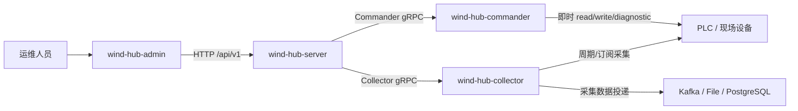
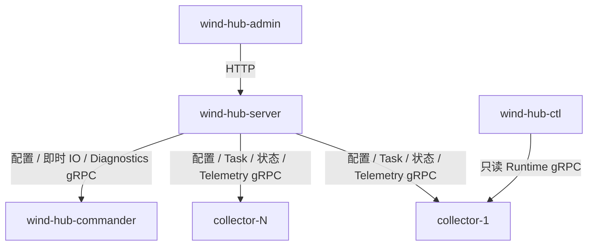
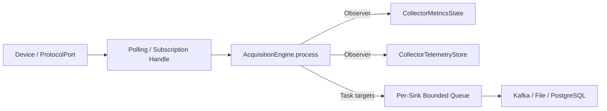
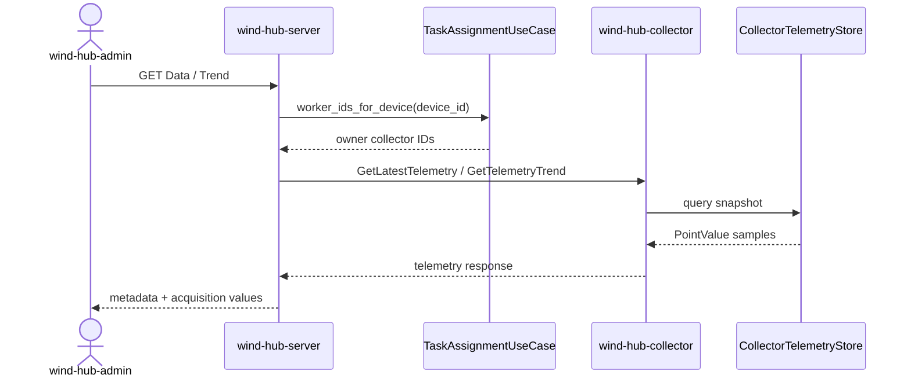
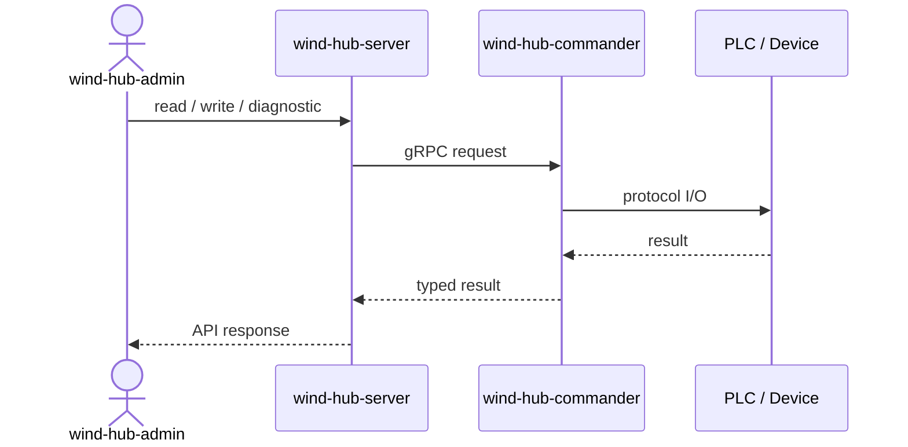
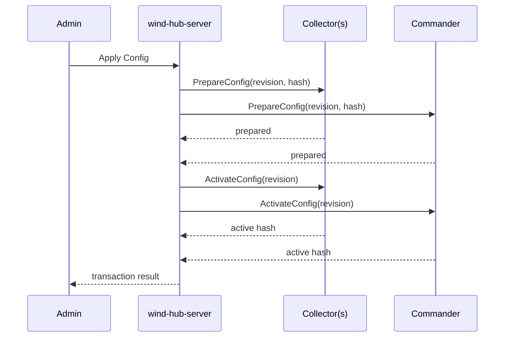

<h1 class="title">wind-hub 软件架构设计</h1>

<p class="subtitle">v0_1 · 20261003</p>

<style>
body {
  font-family: "Microsoft YaHei";
  font-size: 16px;
  line-height: 1.75;
  color: #24292f;
}
.title {
  font-family: "Microsoft YaHei";
  font-size: 32px;
  line-height: 1.30;
  font-weight: 700;
  text-align: center;
}
.subtitle {
  font-family: "Microsoft YaHei";
  font-size: 18px;
  line-height: 1.50;
  font-weight: 400;
  text-align: center;
}
h1 {
  font-family: "Microsoft YaHei";
  font-size: 28px;
  line-height: 1.40;
  font-weight: 700;
}
h2 {
  font-family: "Microsoft YaHei";
  font-size: 22px;
  line-height: 1.40;
  font-weight: 700;
}
h3 {
  font-family: "Microsoft YaHei";
  font-size: 18px;
  line-height: 1.50;
  font-weight: 700;
}
h4 {
  font-family: "Microsoft YaHei";
  font-size: 16px;
  line-height: 1.50;
  font-weight: 700;
}
p, li {
  font-family: "Microsoft YaHei";
  font-size: 16px;
  line-height: 1.75;
}
.figure-caption,
.formula-caption {
  font-family: "Microsoft YaHei";
  font-size: 14px;
  line-height: 1.50;
  font-weight: 600;
  text-align: center;
  margin: 0.65em 0 0.35em 0;
}
.table-caption {
  font-family: "Microsoft YaHei";
  font-size: 13px;
  line-height: 1.40;
  font-weight: 500;
  text-align: center;
  margin: 0.65em 0 0.35em 0;
}
.mermaid,
.mermaid text,
.mermaid .label {
  font-family: "Microsoft YaHei" !important;
  font-size: 14px !important;
  line-height: 1.20;
}
table {
  width: 100%;
  border-collapse: collapse;
  font-family: "Microsoft YaHei";
  font-size: 13px;
  line-height: 1.45;
}
table th,
table th p,
table th li {
  font-family: "Microsoft YaHei";
  font-size: 13px;
  line-height: 1.40;
  font-weight: 600;
}
table td,
table td p,
table td li {
  font-family: "Microsoft YaHei";
  font-size: 13px;
  line-height: 1.45;
  font-weight: 400;
}
table th,
table td {
  padding: 0.40em 0.60em;
  vertical-align: top;
}
code, pre {
  font-family: "Cascadia Code";
  font-size: 14px;
  line-height: 1.50;
}
p code, li code, td code {
  color: #24292f;
  background: #f3f4f6;
  padding: 0.08em 0.28em;
  border-radius: 3px;
}
pre {
  color: #c9d1d9;
  background: #0d1117;
  padding: 1em;
  border-radius: 6px;
  overflow-x: auto;
}
pre code {
  color: inherit;
  background: transparent;
  padding: 0;
}
.hljs-comment, .hljs-quote,
.token.comment, .token.prolog, .token.doctype, .token.cdata {
  color: #8b949e;
  font-style: italic;
}
.hljs-keyword, .hljs-selector-tag, .hljs-literal,
.token.keyword, .token.boolean { color: #ff7b72; }
.hljs-string, .hljs-doctag, .hljs-regexp,
.token.string, .token.char, .token.regex { color: #a5d6ff; }
.hljs-number, .token.number { color: #79c0ff; }
.hljs-title, .hljs-function, .token.function { color: #d2a8ff; }
.hljs-title.class_, .hljs-type, .hljs-built_in,
.token.class-name, .token.builtin { color: #ffa657; }
.hljs-variable, .hljs-attr, .hljs-property,
.token.variable, .token.property, .token.attr-name { color: #7ee787; }
.hljs-operator, .hljs-punctuation,
.token.operator, .token.punctuation { color: #c9d1d9; }
</style>

---

## 目录

1. [文档约定](#1-文档约定)
2. [文档定位与使用方式](#2-文档定位与使用方式)
3. [系统边界](#3-系统边界)
4. [进程与通信架构](#4-进程与通信架构)
5. [采集数据链](#5-采集数据链)
6. [即时控制与诊断链](#6-即时控制与诊断链)
7. [配置与任务控制链](#7-配置与任务控制链)
8. [可靠性与交付语义](#8-可靠性与交付语义)

---

# 1. 文档约定

本章是全文的固定排版与表达规范。文档修订、补充和派生版本均应遵守本章，不再根据个人习惯调整字体、字号、行距、图题、表题、公式或代码样式。

本文开头的 `<style>...</style>` 是 HTML `style` 元素，其中包含内部 CSS 样式表，本文简称为 **CSS 样式块**。第 1.1～1.4 节规定目标样式；CSS 样式块通过 `h1`、`h2`、`p`、`table`、`th`、`td`、`pre`、`code` 等选择器，将规范应用到 Markdown 渲染后生成的 HTML 元素。

## 1.1 字体约定

<p class="table-caption">表 1-1 文档字体与排版规范</p>

| 文档元素 | 字体 | 字号 | 行间距/行高 | 字重 | 对齐方式 |
|---|---|---:|---:|---:|---|
| 文档标题 | Microsoft YaHei | 32 px | 1.30 | 700 | 居中 |
| 文档副标题 | Microsoft YaHei | 18 px | 1.50 | 400 | 居中 |
| 一级标题 | Microsoft YaHei | 28 px | 1.40 | 700 | 左对齐 |
| 二级标题 | Microsoft YaHei | 22 px | 1.40 | 700 | 左对齐 |
| 三级标题 | Microsoft YaHei | 18 px | 1.50 | 700 | 左对齐 |
| 四级标题 | Microsoft YaHei | 16 px | 1.50 | 700 | 左对齐 |
| 正文 | Microsoft YaHei | 16 px | 1.75 | 400 | 左对齐 |
| 图题 | Microsoft YaHei | 14 px | 1.50 | 600 | 居中 |
| 图内文字 | Microsoft YaHei | 14 px | 1.20 | 400 | 按图形布局 |
| 表题 | Microsoft YaHei | 13 px | 1.40 | 500 | 居中 |
| 表头 | Microsoft YaHei | 13 px | 1.40 | 600 | 左对齐 |
| 表格正文 | Microsoft YaHei | 13 px | 1.45 | 400 | 左对齐 |
| 公式题 | Microsoft YaHei | 14 px | 1.50 | 600 | 居中 |
| 代码文字 | Cascadia Code | 14 px | 1.50 | 400 | 左对齐 |

以上规范已经通过本文开头的 CSS 样式块固定。其中，正文为 `16 px`；表题、表头和表格正文均为 `13 px`。表头字重为 `600`，低于标题字重；表格正文行高为 `1.45`，因此表格在字号、字重和行距上均明显弱于正文。英文业务对象、数据库对象和程序标识符仍按所在文本元素的字号排版，但使用行内代码形式，例如 `Asset`、`Connection`、`task_id`。

## 1.2 绘图约定

1. 上下文图、第 0 层及更深层 DFD、总体流程图和关系流程图统一使用 Mermaid。
2. 每一个 Mermaid 图都必须在 Mermaid 代码块第一行加入初始化配置，统一只设置 `useMaxWidth: true`。初始化配置格式为：

```text
%%{init: {"<Mermaid 图类型配置域>": {"useMaxWidth": true}}}%%
```

其中 `<Mermaid 图类型配置域>` 必须根据实际 Mermaid 图类型替换，不得固定写成 `flowchart`，也不得使用与实际图类型不匹配的配置域。

<p class="table-caption">表 1-2 Mermaid 图类型与初始化配置</p>

| Mermaid 图类型 | 图声明 | 第一行初始化配置 |
|---|---|---|
| Flowchart | `flowchart TB/LR/...` | `%%{init: {"flowchart": {"useMaxWidth": true}}}%%` |
| Sequence Diagram | `sequenceDiagram` | `%%{init: {"sequence": {"useMaxWidth": true}}}%%` |
| State Diagram | `stateDiagram-v2` | `%%{init: {"state": {"useMaxWidth": true}}}%%` |
| Class Diagram | `classDiagram` | `%%{init: {"class": {"useMaxWidth": true}}}%%` |
| ER Diagram | `erDiagram` | `%%{init: {"er": {"useMaxWidth": true}}}%%` |

若后续使用其他 Mermaid 图类型，也必须遵守同一规则：

```text
实际图类型
    ↓
确定该图类型对应的 Mermaid 配置域
    ↓
第一行写入：
%%{init: {"对应配置域": {"useMaxWidth": true}}}%%
```

不得额外加入 `wrap` 等非统一配置；如确有特殊需要，应在对应图的局部设计说明中单独论证。

3. 每张图必须有图编号和图题，编号采用“章节号-本章图序号”，例如“图 7-2”。
4. 图题必须使用普通图题样式，不得使用 Markdown 标题。统一写法为：

```html
<p class="figure-caption">图 7-2 图题</p>
```

## 1.3 公式约定

1. 行内公式使用单美元符号，例如 `$E_1$`。
2. 独立公式使用双美元符号，例如：

```text
$$
\mathrm{Entity}=E_1\land(E_2\lor E_3\lor E_4)\land E_5
$$
```

3. 正式公式不得放入代码块。
4. 不使用 `\[` 与 `\]` 作为公式定界符。
5. 变量下标统一写成 `E_1`、`R_1`；逻辑“与”和“或”统一写成 `\land`、`\lor`。
6. 公式必须使用 LaTeX，不使用普通文本模拟数学符号。
7. 需要编号的公式使用“式（章节号-本章公式序号）”，式题采用普通公式题样式：

```html
<p class="formula-caption">式（8-1）实体判断逻辑</p>
```

## 1.4 代码约定

1. 多行代码必须使用带语言标识的围栏代码块，例如 `python`、`sql`、`json`、`yaml`、`mermaid` 或 `text`。
2. 单个标识符、字段名、命令和短代码使用行内代码，例如 `PRIMARY KEY`、`Connection`。
3. 伪代码必须明确标记为 `text` 或在正文中说明“以下为伪代码”；不得使读者误认为它可以直接运行。
4. 代码块统一使用深色背景，颜色为 `#0D1117`；普通代码文字颜色为 `#C9D1D9`。
5. 语法高亮统一采用表 1-2 的配色。Markdown 渲染器应使用 Highlight.js 或 Prism 可识别的语言标识；渲染器不支持高亮时，至少保留代码背景色和普通代码文字颜色。

<p class="table-caption">表 1-2 代码语法高亮配色</p>

| 语法元素 | 颜色 | 十六进制 |
|---|---|---|
| 代码背景 | 深黑蓝 | `#0D1117` |
| 普通文字、运算符和标点 | 浅灰 | `#C9D1D9` |
| 注释 | 灰色 | `#8B949E` |
| 关键字和布尔值 | 红色 | `#FF7B72` |
| 字符串和正则表达式 | 浅蓝 | `#A5D6FF` |
| 数值 | 蓝色 | `#79C0FF` |
| 函数名 | 紫色 | `#D2A8FF` |
| 类型、类名和内置对象 | 橙色 | `#FFA657` |
| 变量、属性和字段 | 绿色 | `#7EE787` |

---

# 2. 文档定位与使用方式

## 2.1 适用对象

本文描述当前 wind-hub 源码的运行时软件架构，供后端开发、前端联调、代码审查、
测试设计和生产验收使用。本文不描述容器编排、双机热备、集群拓扑、证书部署等
部署层问题。

配置字段以 `docs/config.md` 为准；协议与 Sink 扩展接口以
`docs/spi.md` 为准；本文件只描述模块边界、运行时数据流和跨进程控制关系。

## 2.2 目标

本文用于固定以下架构事实：

1. Collector、Commander、Server 的职责不能相互侵入；
2. 正常采集数据与即时控制数据采用不同链路；
3. Data/Trend 必须来自 Collector 的真实采集结果，不由页面刷新触发 PLC 读取；
4. Server 是配置事务和 Task placement 的协调者；
5. Collector Sink 当前采用 at-most-once 交付语义；
6. 跨进程交互统一经 `wind_hub_core.rpc` 中的 gRPC 契约。

---

# 3. 系统边界

wind-hub 面向设备协议通信、数据采集、数据投递和运维控制。设备、外部 Sink 和
浏览器属于系统边界之外。

<p class="figure-caption">图 3-1 wind-hub 系统边界</p>



系统内进程不通过直接 import 访问其他进程包。依赖方向由 import-linter 固化：

```text
collector ─┐
commander ─┼──> core
server ────┤
ctl ───────┘
```

`wind_hub_core` 不依赖任何进程包。

---

# 4. 进程与通信架构

<p class="table-caption">表 4-1 进程职责</p>

| 进程/模块 | 核心职责 | 明确不负责 |
|---|---|---|
| Collector | 设备采集、Task Instance、重连、采集状态、Sink 队列与投递、Latest/Trend 采集读模型 | Admin HTTP、页面控制、即时人工读写 |
| Commander | 即时 read/write、协议诊断、控制回读、设备会话 generation | 周期采集、历史趋势、Sink 投递 |
| Server | Admin API、配置事务、Task placement、Worker Registry、质量/健康聚合 | 直接装配协议驱动、直接访问 PLC |
| CTL | Collector gRPC 只读诊断 | 修改配置、控制 PLC |
| Core | 配置、领域模型、协议驱动、共享 RPC 契约 | Server/Collector/Commander 应用编排 |

Server 同一配置集协调多个 Collector 和一个 Commander。Collector ID 是稳定 worker
标识；Task placement 由 Server 按 generation 下发并由 Collector 在 start 操作时校验。

<p class="figure-caption">图 4-1 跨进程通信关系</p>



---

# 5. 采集数据链

## 5.1 采集执行

Collector 的设备协议实例由 `Device` 聚合，Task Definition 根据
`device` 或 `device_group` 展开为稳定 Task Instance。实例只有收到显式 start
后才获得 acquisition handle。

轮询协议使用 fixed-rate polling handle；ADS Notification、IEC104 spontaneous
等订阅型协议通过回调进入同一个 `AcquisitionEngine.process()`。Runtime 不使用
APScheduler。

采集读失败、连接失败和超时不会终止 Collector 主进程。设备状态通过
`DeviceRuntimeState` 管理并按退避窗口重连；Task Instance 状态与设备连接状态分离。

## 5.2 统一数据出口

所有有效或 BAD 的 `PointValue` 批次最终进入 `AcquisitionEngine.process()`。
该入口同时完成：

- 采集计数；
- BAD 点计数；
- Observer 通知；
- 按 Task targets 向 Sink 派发。

Collector 的 `CollectorTelemetryStore` 作为 Observer 保存真实采集的 Latest 与
有界短期 Trend；它不发起设备通信。

<p class="figure-caption">图 5-1 Collector 采集数据流</p>



## 5.3 Server Data / Trend

Server 不维护周期采集副本，也不通过 Commander 为页面刷新额外读 PLC。

Data/Trend 查询步骤：

1. Server 从当前配置确认设备和点定义；
2. `TaskAssignmentUseCase` 找到该设备实际 owner Collector；
3. Server 经 Collector gRPC 查询 Latest/Trend；
4. 多 Collector 场景下 Latest 按点取时间戳最新样本；
5. Trend 合并后按时间排序，并执行每点 limit；
6. 页面没有采集数据时返回空值，不回退到 Commander 读取。

<p class="figure-caption">图 5-2 Data / Trend 读取链</p>



---

# 6. 即时控制与诊断链

Commander 与 Collector 的职责不同。Commander 只有在用户主动执行 read、write、
write-readback 或 protocol diagnostic 时才访问设备。

<p class="figure-caption">图 6-1 即时设备操作链</p>



Commander 使用 generation 管理设备会话。配置 `prepare` 只构造候选 generation，
`activate` 原子切换 active generation；旧 generation 等待 in-flight operation
排空后关闭。不存在兼容性的单步 `reload()` 入口。

---

# 7. 配置与任务控制链

## 7.1 配置事务

Server 是配置版本与事务协调者。Worker 不自行决定配置版本。

配置变更采用三段式协议：

```text
Prepare
→ 校验候选配置并建立 prepared revision
→ Activate
→ 原子切换 active revision
```

中止或失败时使用 `Abort` 撤销 prepared revision。Server 周期执行 reconciliation，
比较 worker revision/hash 并收敛中断事务。

<p class="figure-caption">图 7-1 配置事务时序</p>



## 7.2 Task placement

Server 为 Collector 下发完整 placement snapshot 和单调递增 generation。
Collector 在 start task / start instance 时验证：

- 已收到 placement；
- 请求 generation 与当前 generation 相同；
- task 确实分配给本 Collector。

Server 周期 reconciliation 会停止错误 Worker 上仍在运行的实例。Task 不因
Collector 进程启动而自动开始。

---

# 8. 可靠性与交付语义

## 8.1 设备侧

- 设备连接采用 best-effort：单设备失败不阻止 Collector 启动；
- 读失败按连接级/协议级区分；
- 连接级失败进入节流重连；
- 单点错误用 `Quality.BAD` 表达，不伪造整批成功或整批失败；
- Task Instance 单次采集失败后保留，下一周期继续执行。

## 8.2 Sink 侧

每个 Sink 有独立有界队列。背压策略由 `RuntimeConfig.backpressure_policy`
决定：

- `drop_old`：队列满时淘汰最旧批次；
- `drop_new`：队列满时丢弃新批次；
- `block`：等待队列可用，对采集链施加背压。

当前外部交付是 **at-most-once**：

1. 批次成功入队时计入 `points_routed`；
2. 背压主动丢弃时计入 `points_dropped`；
3. 批次出队后若 `sink.write()` 失败，不重新入队、不补发；
4. 该批点数同样计入 `points_dropped`，并记录 `sink_write_failed` 事件；
5. Sink 后续成功写入时可恢复健康，但故障期已失败批次不回放。

因此，当前内存队列不构成持久化缓冲。若未来要求故障期数据不丢，应单独设计
持久化 spool/WAL/DLQ，并重新定义 delivery contract，而不是在现有 consumer 中
隐式增加无限重试。

## 8.3 验证边界

日常开发按风险分层：

- Fast Gate：静态检查、unit/component/contract、前端 Vitest/build；
- PR Gate：只运行本次变更命中的 integration/system/E2E；
- Release Gate：完整常规软件验证；
- Qualification：真实硬件、performance、soak。

Hardware、Performance、Soak 的未执行不能用普通 Release PASS 代替。
